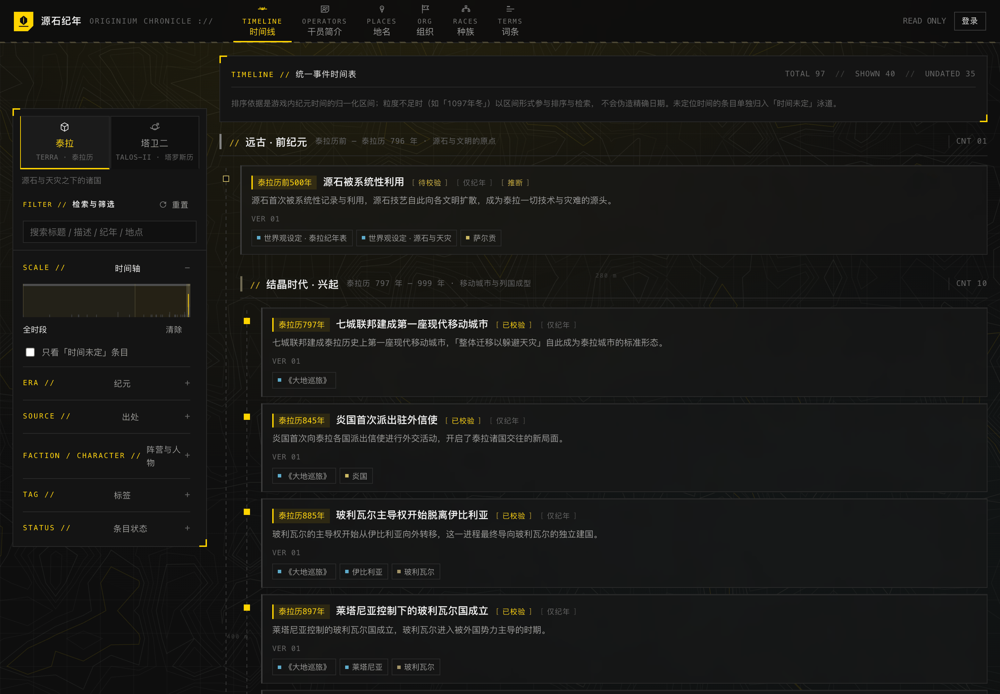

<div align="center">


# 源石纪年 · Originium Chronicle

**《明日方舟》系列的统一事件时间表**：把散落在主线、活动与设定集里的事件抽出来，
按各自的游戏内纪年（泰拉历 / 塔罗斯历）排序，并让每一条时间都带着它的可靠程度。


<!-- 截图维护：1440×1000 视口 @2x（输出 2880×2000），Chrome headless 带
     --force-prefers-reduced-motion 拍摄 —— 站点首屏外内容靠 IntersectionObserver
     揭示，关掉动效才能一次拍到完整静态画面；改版后按同样参数重拍即可。 -->


</div>

## ⚠️ 免责声明

这是一个**个人兴趣项目**，与鹰角网络（Hypergryph）**无任何隶属、合作或授权关系**。

- 《明日方舟》及其相关的名词、设定、剧情文本、角色名称等知识产权**归鹰角网络所有**。
  本仓库仅在**出处引用与考据讨论**的意义上收录少量原文片段（种子数据中的引文均为短句，
  用于演示「引用可定位」校验），**不是游戏资料的再分发渠道**。
- 本项目是网页端的考据协作工具：**不包含、不修改、不模拟任何游戏客户端**，
  不提供游戏内资源、抽卡、脚本、代练或账号交易类功能。
- **不收集、不中转、不代理**任何鹰角账号凭据，也不逆向对方私有接口（详见「[安全与隐私](#安全与隐私)」）。
- 人物档案一律**外链到该世界自己的维基**（泰拉 → [PRTS](https://prts.wiki/)，塔卫二 → [终末地 WIKI](https://www.fz.wiki/)），本仓库只写一行与时间线相关的简介，不复制对方正文。
- 若权利方认为某处内容不妥，开 issue 告知即可，会立即删除。

## 它解决什么问题

《明日方舟》的世界观记录分散在主线、活动、干员档案与设定集里，且**纪年粒度极不统一**——
「1096年12月23日」「1097年冬」「1098年」「纪元前（年表未载）」会出现在同一份年表里，
官方明写、设定集推断与社区考据彼此混杂。现有 wiki 以「页面」为单位组织内容，
「这两条谁先发生」只能靠人翻资料拼。

本项目把时间线当**一等公民**：

- 时间是结构化字段，可排序、可检索、可做一致性检查
- 每条时间带**可信度**（已确证 / 推断 / 存疑），不把推断伪装成事实
- **AI 只能产出提案**，人工放行后才写入时间线
- 多人同时校对同一条目时，**不丢任何一方的修改**
- **两个世界的年表分开排序**：泰拉历与塔罗斯历的数值之间没有可比关系，
  混在一条序列里得到的顺序看起来正常、实际毫无意义 —— 所以世界是一级维度，不是筛选项

## 功能

| 能力 | 说明 |
| --- | --- |
| **统一时间线** | 主线 / 支线 / 活动 / 设定集事件按各自纪年排序，纪元色带分组，右侧抽屉查看与编辑 |
| **双世界年表** | 泰拉（泰拉历 1096—1101 为主）与塔卫二（塔罗斯历 1—152）各自成表，纪元、出处、刻度、统计全部按世界隔离，侧栏一键切换 |
| **多维检索** | 时间区间（含跨年季节）/ 纪元 / 出处 / 阵营（含子阵营）/ 人物 / 标签 / 状态 / 可信度 + 全文搜索 |
| **人物简介** | 卡片列表 + 详情页（简介、结构化字段、按世界分组的相关条目）；档案外链该世界自己的维基，这里不维护副本 |
| **AI 辅助梳理** | 从剧情原文批量抽取事件候选，四层校验后进入待审队列；**AI 不能直接写时间线** |
| **人工编辑** | 完整 CRUD、关系编辑、版本回滚、软删除与恢复 |
| **标注与纠错** | 任何人（含未登录访客）可提交备注 / 纠错 / 存疑 / 复核，无需编辑权限 |
| **协作安全** | 乐观锁 + 字段级三方合并 + 编辑租约 + 全量版本链 |
| **一致性巡检** | 因果倒置、时代错位、出处矛盾、疑似重复、锚点失效 → 收敛式异常收件箱 |
| **权限与账号** | 四级角色（预备干员 / 干员 / 精英干员 / 博士）+ 出处归属 + 条目冻结；账号管理含操作日志与三条防锁死约束 |

## 快速开始

需要 **PHP 8.3+** 与 **Composer**。应用本身**不需要 Node** —— 视图直接引用
`public/assets/` 下的手写 CSS/JS，没有 `@vite` 依赖。

```bash
composer install
cp .env.example .env && php artisan key:generate
php artisan migrate:fresh --seed
php artisan serve                      # http://localhost:8000
```

`.env.example` 默认走 **SQLite**，开箱即用，不需要额外起数据库服务；
换成 MySQL / PostgreSQL 只需改连接信息（表前缀由 `DB_PREFIX` 控制，MySQL 连接上的默认值是 `arknight_`）。

> `composer setup` 会把上述步骤串起来，但末尾包含 Laravel 骨架自带的 `npm run build`（本项目未使用 Vite），没有 Node 时忽略该步即可。

<details>
<summary><b>Docker 与全部环境变量</b></summary>

把命令里的 `php artisan` 换成：

```bash
docker exec -w /app <容器名> php artisan migrate:fresh --seed
```

> 容器内的 `127.0.0.1` 指容器自身；数据库跑在宿主机上时需 `DB_HOST=host.docker.internal`
> （Docker Desktop for macOS / Windows 支持；Linux 需另配）。

除 Laravel 骨架自带的变量外，本项目用到下面这些，**全部有可用默认值**，不配置也能跑起来：

| 变量 | 默认 | 说明 |
| --- | --- | --- |
| `TIMELINE_AI_DRIVER` | `heuristic` | AI 梳理驱动。`heuristic` 是零依赖规则抽取；改 `openai-compatible` 才真正调用模型 |
| `TIMELINE_AI_ENDPOINT` / `TIMELINE_AI_KEY` / `TIMELINE_AI_MODEL` | OpenAI 端点 / 空 / `gpt-4o-mini` | 仅 `openai-compatible` 使用；**没有 Key 时静默降级回 `heuristic`**，不会让站点挂掉 |
| `TIMELINE_PER_PAGE` / `TIMELINE_LEASE_SECONDS` / `TIMELINE_REVISION_KEEP` | 见 `config/timeline.php` | 每页条数 / 编辑租约时长 / 版本快照保留数 |
| `IDENTITY_REGISTRATION` | `true` | 是否开放自助注册 |
| `IDENTITY_AVATAR_MAX_KB` / `IDENTITY_AVATAR_SIZE` | `2048` / `256` | 头像上传上限与输出边长 |
| `HYPERGRYPH_CLIENT_ID` / `HYPERGRYPH_CLIENT_SECRET` / `HYPERGRYPH_AUTHORIZE_URL` / `HYPERGRYPH_TOKEN_URL` / `HYPERGRYPH_USERINFO_URL` | 空 | 鹰角通行证渠道；**五项全空时显示「未启用」**，不影响其他功能 |
| `TIMELINE_WIKI_BASE` / `TIMELINE_WIKI_LABEL` | `https://prts.wiki/w/` / `PRTS 维基` | 泰拉干员档案的外链目标 |
| `TIMELINE_TALOS_WIKI_BASE` / `TIMELINE_TALOS_WIKI_LABEL` | `https://www.fz.wiki/wiki/干员/` / `终末地 WIKI` | 塔卫二人员档案的外链目标 |

**密钥不要提交**：`.env` 已在 `.gitignore` 里，`HYPERGRYPH_CLIENT_SECRET` 与 `TIMELINE_AI_KEY`
只应存在于本地 `.env` 或部署平台的密钥管理中。

</details>

### 演示账号

浏览时间线**无需登录**。预置账号刻意让登录名（ASCII）与昵称（中文）不同，
以便看出这两个字段是分离的；登录时**邮箱或登录名都可以**：

| 登录名 | 密码 | 角色 |
| --- | --- | --- |
| `archivist` | `terra-admin` | 博士（管理员） |
| `reviewer` | `terra-reviewer` | 精英干员 |
| `editor` | `terra-editor` | 干员 |
| `reader` | `terra-viewer` | 预备干员 |
| `suspended` | `terra-disabled` | 干员（已禁用，用于演示状态筛选，无法登录） |

种子还带两条外部身份绑定样本（一条「已核验」、一条「待核验」），登录 `archivist` 后
进 `/admin/users` 的账号详情即可看到核验入口。

> 这些密码写在 `TimelineSeeder` 里，**只为本地演示与自动化测试而存在**。
> 自己部署时请务必先改掉管理员密码（或在 seed 之后直接删掉演示账号）。

## 常用命令

```bash
php artisan migrate:fresh --seed      # 重建数据库 + 灌入起始语料
                                      # 种子对条目是「已存在就整批跳过」：改了种子内容要用 fresh，
                                      # 单跑 db:seed 只会刷新字典
php artisan test                      # 全量测试（330 项 / 2893 断言）
./vendor/bin/pint                     # 代码风格（Laravel 官方风格）

php artisan timeline:scan             # 全量一致性体检 → 异常收件箱
php artisan timeline:scan --rebuild   # 同时按纪元区间补全未归属条目的 era_id
php artisan citations:verify          # 复核每条引文能否在出处语料中逐字定位
php artisan citations:verify --fix    # 语料改动后重算引文字符偏移与行号
php artisan timeline:purge-locks      # 回收过期编辑租约（定时任务已自动执行）
```

定时任务（见 `routes/console.php`）：`timeline:scan` 每小时、`timeline:purge-locks` 每 15 分钟，均带 `withoutOverlapping`。

## 页面

| 路径 | 作用 |
| --- | --- |
| `/` | 时间线：世界切换器 + 多维筛选 + 纪元分组条目流 + 条目抽屉（查看 / 编辑 / 标注 / 版本）。`?world=talos` 进塔卫二年表 |
| `/sources`、`/sources/{slug}` | 出处与语料库：录入剧情原文（AI 抽取与引用定位的地基）、编辑原文、触发梳理 |
| `/proposals` | AI 审核台：逐条核验引文，采纳 / 合并 / 驳回 |
| `/anomalies` | 一致性收件箱：处理巡检异常，可全量体检 |
| `/operators`、`/operators/{slug}` | 人员列表（分干员 / 历史人物 / 剧情人物三档）与详情页 |
| `/places` `/organizations` `/races` `/terms` | 词典四页：地名（成树，可记别名）、组织（按类型分组）、种族、词条（按世界分列） |
| `/admin/users` | 账号管理（仅管理员）：搜索/排序表格、批量操作、重置密码、外部身份核验、操作日志 |
| `/settings/profile` | 个人设置：头像、昵称、密码、外部渠道绑定与解绑 |
| `/login` `/register` `/register/external` | 登录、自助注册、外部渠道注册补全 |

<details>
<summary><b>目录结构（节选）</b></summary>

```
app/
├─ Enums/            世界、角色、时间精度/可信度、条目与提案状态、异常类型…
├─ Support/          TerraDate（网格索引与区间语义）、TerraDateParser、TextSimilarity
├─ Services/         EventWriter（唯一写入入口）、EventLockService、TimelineConsistencyChecker、
│                    ProposalApplier、UserManager、AvatarService、Identity/、Ai/
├─ Rules/ Policies/  命名校验、权限矩阵（含 UserPolicy 自保护）
├─ Http/             Controllers（Timeline / Event / AiProposal / Anomaly / Source / User /
│                    Operator / Auth / Settings）、Middleware、Requests
└─ Models/           Event, Era, Faction, Character, Source, Tag, EventRevision, Annotation,
                     EventLock, AiProposal, TimelineAnomaly, UserActivityLog, UserIdentity

database/migrations/ 字典层 / 事件表 / 关系表 / 协作表 / 用户与身份
database/seeders/    起始语料（见下节）
docs/DESIGN.md       完整设计说明
public/assets/       app.css, app.js（无构建步骤）
resources/views/     布局与各页面视图 + 组件
tests/               单元 + 功能测试（含迁移注释与列名冲突守卫）
```

</details>

## 核心设计

完整说明见 **[`docs/DESIGN.md`](docs/DESIGN.md)**，这里是五个最关键的决策。

### 1. 时间用「区间 + 精度 + 可信度」，不用 datetime

泰拉历不是可用历法。把「1097年冬」存成 `1097-12-01` 是**伪造精度**：判断
「1098年1月是否属于1097年冬」时会直接出错，且用户无法察觉。

```
date_display          原始纪年文本，展示层只认它，绝不从索引反推
start_index/end_index 网格索引 = year*372 + (month-1)*31 + (day-1)，单调递增
date_precision        day / month / season / year / range / relative / unknown
date_confidence       confirmed / inferred / disputed / unknown
```

精度不足只体现为「区间更宽」，语义始终正确（冬季跨年 → 月份允许 > 12）；
筛选按**区间重叠**而非包含；`unknown` 的条目进独立的「时间未定」泳道，不污染有序序列。

### 2. AI 只能写提案，不能写时间线

> **铁律：AI 的任何输出都落在 `ai_proposals`，`events` 表只由人工放行后写入。**

幻觉在产品层的表现不是报错，而是时间线上多出一条「看起来完全合理」的假事件，比缺失更难发现。
因此产出必须经过四层校验：

| 层 | 内容 | 不通过的后果 |
| --- | --- | --- |
| L1 结构 | 必填字段非空、枚举合法 | 直接丢弃 |
| L2 时间可解析 | `date_display` 必须解析出网格索引 | 禁止直接入库 |
| L3 **出处可定位** | 引文须能在原文中定位（容忍空白标点，**不容忍改写**），偏移与行号一并落库 | 硬闸门（`citations:verify` 随时复核） |
| L4 一致性 | 时代错位 / 疑似重复 / 锚点失效 | 阻断级禁止入库 |

闸门分两级：**硬闸门**（缺可定位出处）不可被 `overrides` 绕过，必须显式确认并留下免责痕迹；
**软闸门**（时间不可解析、一致性阻断）可补正后放行。采纳后 revision 的
`origin = ai`、`user_id = 审核人`，「谁为这条 AI 内容负责」永远有答案。

### 3. 多人编辑：冲突分三层，三种机制分别解决

| 层次 | 机制 |
| --- | --- |
| **结构层** | 排序是**派生量**（查询时按索引计算），表里没有 `prev/next` 链表字段，并发插入无需协调 |
| **字段层** | 乐观锁 CAS（`WHERE version = ?`）+ 字段级三方合并：对方独有改动自动并入，只把真正打架的字段交人裁决 |
| **语义层** | 规则巡检：写入后立即体检 + 定时全量巡检，本轮未复现的告警自动销案 |

编辑租约是**软锁**（5 分钟，可续租）——硬锁会产生僵尸锁，而数据安全已由乐观锁保证；
基线不可用时（版本快照已裁剪）**把所有不一致判为冲突**，绝不静默覆盖他人已确认的内容。

### 4. 权限：读全开放，「看提案」≠「放行提案」

表头为界面展示名（取自罗德岛编制序列），括号内是枚举值：

| 能力 | viewer 预备干员 | editor 干员 | reviewer 精英干员 | admin 博士 |
| --- | :-: | :-: | :-: | :-: |
| 浏览 / 检索 | ✔ | ✔ | ✔ | ✔ |
| 提交标注（含未登录访客） | ✔ | ✔ | ✔ | ✔ |
| 增删改条目、发起 AI 梳理 | — | ✔ | ✔ | ✔ |
| **采纳 / 合并 / 驳回 AI 提案** | — | — | ✔ | ✔ |
| 标记已校验、裁定争议、锁定条目、回滚版本、处置异常 | — | — | ✔ | ✔ |
| **账号管理** | — | — | — | ✔ |

角色之外还叠加：条目进入 `disputed` / `deprecated` 时正文冻结（editor 只能提交建议）、
reviewer 锁定后 editor 完全不可写、出处归属（`source_user`）限制 editor 的改动范围。

### 5. 账号管理：三条硬约束防「把自己锁在门外」

| 约束 | 原因 |
| --- | --- |
| **删除 / 禁用自己一律拒绝** | 这两种操作会立刻让自己失去访问权，几乎只可能是误点 |
| **不能掏空最后一个启用中的管理员** | 否则系统会进入没人能管理账号的死局 |
| **一切变更留痕** | 每次写入追加一条操作日志（操作人、字段级前后值、来源 IP） |

另外：`active` 中间件在每个已登录请求上复核账号状态（Laravel 的 session guard 只在登录那一刻验凭据，
否则「刚被禁用的人」能靠既有会话继续写入）；删除是软删除，但邮箱唯一索引仍被占用，
因此表单校验会明确提示「若属于已删除账号，可先恢复它」。

## ⚠️ 关于种子数据

`TimelineSeeder` 灌入的是**起始语料，不是权威年表**。各层来源的可靠性不同：

| 来源 | 规模 | 时间口径 |
| --- | --- | --- |
| 主线 / 活动剧情 | 34 条 | 较明确的游戏内时间，多为 `inferred` |
| 《大地巡旅》散文卷（世界 / 国家与地区 / 组织） | 32 条 | **年份普遍未载** → `unknown`，进「时间未定」泳道，`needs_review` |
| 《大地巡旅》附录「泰拉纪年」 | 31 条 | 书里唯一的成体系年表（797–1099），`confirmed` 且附逐字引文 |
| 塔卫二年表 | 10 条 | 全部来自**社区考据整理**，非官方原文：可信度只到 `inferred` / `disputed`，**不附引文** |
| 字典（同书派生） | 36 种族 · 47 地名 · 20 词条 · 69 阵营（政体 22 / 地域 1 / 组织 46） | 供人物、条目与检索挂载；四个大类各自成页 |
| 人员名单（快照） | 泰拉 463（443 干员 + 18 历史 + 2 剧情）· 塔卫二 33 | 来自 `docs/prts-干员一览.json` 与 `docs/fz-干员一览.json`，只取名字/代号/种族/势力/出身地，**只新增不覆盖** |
| 账号 | 5 个演示账号 · 2 条外部身份绑定 | 见上文「演示账号」 |

几条刻意的口径：

- **不编造年份**：散文卷条目不塞一个看起来合理的数字，宁可留在泳道里等考据
- **不编造引文**：只有能逐字定位的才附引文；塔卫二条目一律留空 —— 把二级来源写进
  `event_source.quote`，会让「引用可定位」这条校验彻底失去意义
- **不编造正式国名**：拿不准的 `full_name` 一律留空
- **「引用可定位」怎么落地**：`sources.raw_text` 只收**被逐字引用的那一卷**（守住版权边界，
  也因为 MySQL TEXT 上限 64 KB，整书会被静默截断）；`CorpusLocator` 逐字查找并记录字符偏移
  与行号，归一化只丢空白、不动标点，因此**改写过的引文永远定位不到**；
  `SeederIntegrityTest` 是回归网，`citations:verify` 是运维入口

> 原文文件（`docs/TERRA A JOURNEY.txt`）与两份名单导出**不入库**（见 `.gitignore`），
> 本地缺失时 seed 照常跑完。人物头像随仓库分发（`public/assets/avatars/{terra,talos}/`，
> 共 464 张，目录按所属世界命名），抓取清单不入库；
> 清单缺失或图片不在时头像留空，页面退回「首字方块」。

**换句话说：这份数据本身就是产品要解决的问题的样本 —— 它需要被考据者继续纠错。**

## 已知边界

诚实列出当前没有做的事，避免被误读为「已解决」：

- **不做正文级内容冲突的自动合并**：两人都重写了 `details` 时只能人工裁决
- **没有实时协同编辑**（无 OT / CRDT），靠乐观锁 + 合并而非实时同步
- **相对时间只解决了「解析与标记」**：锚点自动回填尚未实现，`precision = relative` 的条目先进「时间未定」并告警
- **巡检是规则式的**，不是语义推理：能发现「结果早于起因」，发现不了「起因与结果其实无关」
- **前端零构建是有意取舍**：部署简单、无 Node 依赖，代价是没有组件化与类型检查。动效同样零依赖
  （原生 CSS + `IntersectionObserver`），只用 opacity / transform，并完整尊重系统「减弱动态效果」
- **名单与头像是快照，不是运行时抓取**（运行环境无外网，且种子必须可复现）：
  要跟上对方更新就重新导出 / 重新抓取，再跑一次 seed
- **出身地只认「整值等于地名或其写法」**：`birth_place` 是短值（「谢拉格」「未公开」），
  不做子串匹配 —— 否则「瓦伊凡」「杜林」这类同名写法会张冠李戴；对不上的如实显示原文并说明
- **远古实体与人物同表**：`岁`（炎国传说中的远古实体，非人）记在 `historical` 档，靠头衔说明身份

## 测试

```bash
php artisan test                      # 330 项 / 2893 断言
```

<details>
<summary><b>覆盖重点</b></summary>

- **时间解析边界**：精度退化、跨年季节、纪元前年份、相对时间不误判为绝对年份、索引往返
- **协作不变量**：不丢更新、字段级冲突、非重叠改动自动合并、版本链只增不改、回滚不覆盖历史
- **权限与冻结**：角色能力边界、条目冻结/锁定、出处范围限制、访客可标注但不可编辑
- **AI 闸门**：AI 产出不落 events、四层校验记录、缺出处不可被 overrides 绕过、重复提案识别
- **检索语义**：区间重叠（跨年季节）、未定位排序、子阵营包含、缩放宽表
- **种子数据完整性**：`date_display` 重解析后与落库索引一致、未定位条目被约束在泳道内、
  纪元区间不重叠、引文不得凭空出现 —— **把起始语料当代码来测**
- **账号与身份**：越权访问、LIKE 通配符转义、排序白名单、软删除可见性、三条防锁死约束、
  命名唯一性、自助注册三条闸门、外部身份 state 一次性消费与防并号
- **头像上传安全**：SVG 被拒、伪装类型被拒、输出必是重编码后的正方形 JPEG、换头像删除旧文件
- **世界隔离**：数据源不混世界、纪元自动归属不跨世界（塔罗斯历 5 年的索引落在泰拉「远古」区间内，
  少了世界条件就会被静默归错）、跨世界同名条目不算疑似重复、条目的世界不可更改
- **迁移与模型守卫**：每个列定义必须带 `comment()`、不得用 `timestamps()`；列名不得与 Eloquent 内部属性重名

</details>

## 安全与隐私

| 事项 | 做法 |
| --- | --- |
| 外部账号绑定 | **不收集、不中转、不代填**对方密码，只能由用户在自己的浏览器里完成授权 |
| 外部令牌 | **不保存** `access_token` / `refresh_token`：外部身份只回答「你是谁」 |
| 邮箱撞车 | 拒绝**静默并号**：外部渠道登录命中已有邮箱时只提示「请先登录再绑定」 |
| 授权回调 | state 一次性消费（防重放）+ 10 分钟有效 + 只保留最近 5 条；**先验 state 再用 code** |
| 绑定会话 | 校验「发起绑定的人 == 回调时的登录人」，避免会话错位把外部身份绑到别人名下 |
| 自助注册的权限 | 角色硬编码为最低档；提交额外字段也无法提权（服务层只接受具体参数） |
| 头像上传 | 一律用 GD **重新编码**（EXIF 与附加数据不保留）；白名单只放 JPG / PNG —— Laravel 的 `image` 规则**允许 SVG**，而 SVG 能内嵌脚本 |
| 头像输出 | 控制器写死 `Content-Type` 与 `nosniff`，不写进 web 根目录、不依赖 `storage:link` |
| 开放注册 | 默认开放但**按 IP 限流**（10 次/分钟），可用 `IDENTITY_REGISTRATION=false` 整体关闭 |
| 密码「可知」标记 | `password_set_at` 区分「库里有哈希」与「本人知道密码」，据此拒绝解绑最后一个登录方式 |
| 管理员保护 | 不能删除/禁用自己、不能掏空最后一个启用中的管理员；账号变更全部写入只追加的审计表 |

## 关于「鹰角账号绑定」

**鹰角网络没有提供面向第三方的公开 OAuth 接口**，因此现状是：

- 走的是通用 OAuth2 授权码流程，端点与字段映射全部在 `config/identity.php`：
  **拿到正式凭据后只填环境变量即可启用，不需要改代码**；没有预置任何猜出来的端点 ——
  逆向私有接口既违反服务条款，也会随对方改版随时失效。
- 凭据到位之前，可用的是「**手工登记通行证 UID → 待核验 → 管理员核验**」路径；
  「待核验」与「已核验」始终分开显示：自助登记只是一句声明，把它渲染成认证等于系统替用户背书。
- 仓库里有一个本地演示渠道（`stub`）让整条链路在没有凭据时也能跑通与测试。
  它对任何点一下的人都放行，因此与 `APP_ENV` 绑定（只在 `local` / `testing`），
  **生产环境不可能出现这个入口**。

## License

**代码**以 [MIT](https://opensource.org/licenses/MIT) 授权：可自由使用、修改、分发。

**但收录的内容不在 MIT 范围内**：《明日方舟》及其相关的名词、设定、剧情文本、角色名称等
知识产权归**鹰角网络（Hypergryph）**所有，本仓库中的引文与设定条目仅作**出处引用与考据讨论**
之用，不得用于商业目的，也不代表权利方的观点或授权。

如果你是权利方，且认为某处内容不妥，开 issue 或直接联系我，会立即移除相关内容。
